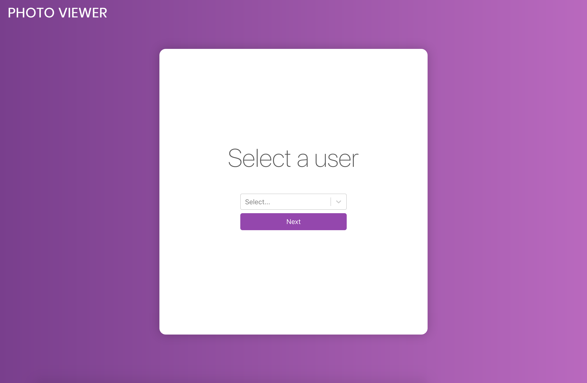

# Photo Viewer App

## React App to view images from a user's selected album. Fetches from jsonplaceholder API.

## Installation & Start Up
`git clone https://github.com/vadimgavrish/tech-challenge.git photoViewer`

`cd photoViewer/frontend`

`npm install`

`npm start`

Go to `http://localhost:3000/`

## Screenshots

